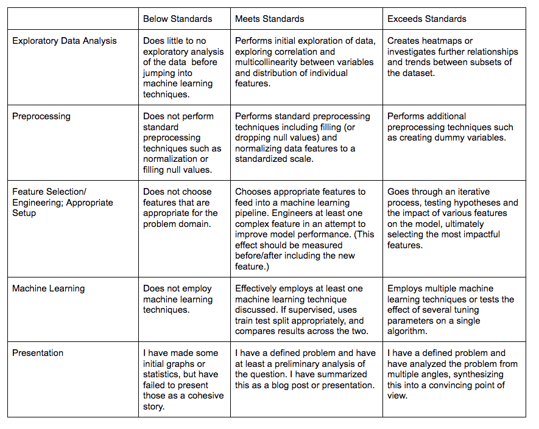

# Introduction to Data Science: Final Project

For the final project, we will be building upon the midterm and conducting a full data science pipeline from start to finish.  Your goal is to come up with a question that could be answered using your current toolset. You’ll combine your analytical and modelling skills with API calls to acquire your own dataset to answer your question. Pick a dataset that you can split into multiple groups to compare to one another, make observations and answer a larger question. See the rubric below for specific requirements. From there, you will practice a standard data science workflow, exploring the initial data, cleaning null values and transforming features as appropriate. (For example, you might have to create dummy variables from a categorical variable if you wish to use that information within a regression model.) Finally you will then apply a machine learning technique whether it be regression, classification or clustering in order to yield further insights and a useful model for analysis or predictive purposes.

Here's a rubric to guide you for the most important aspects regarding the project:  

When choosing a project topic, thinking of the data available is mission critical; what data will you acquire? How will this help you answer a question of interest? What do you hope to find or do? We’ve investigated some of the foundations of API calls, but all vary from one to another and some OAuth patterns can become quite complicated. For this reason, we will support the following APIs for the final project:  
* Yelp
* Open311
* Open Movie Database
* Google Maps

Using other APIs may be acceptable, but support may be limited. Talk to your instructor early and be prepared to choose an alternative option if you attempt to use another API.   
  
There are also a number of flat data files available at many sources including:  
* U.S. Census
* UK Data Service
* Data.Gov.UK
* Kaggle
* Google’s [New] Dataset Search
* Data.gov
* NYC Open Data
  
Here’s another very comprehensive list for further ideas:  
https://github.com/awesomedata/awesome-public-datasets

